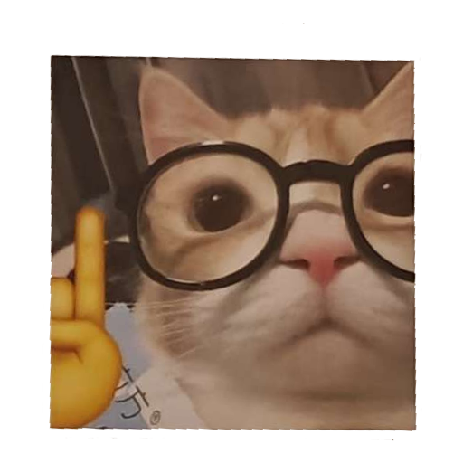
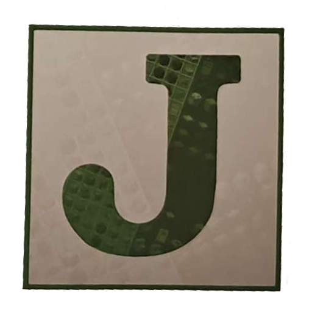

:::caution[Deadline]
The group order will be finalized on **September 17th!**
:::

You can sponsor Modtoberfest by joining our group order. Simply send us your sticker artwork and we will put in an
order with [Zap Creatives](https://zapcreatives.com). Doing a group order allows us to take advantage of quantity based
discounts, and offer different types of stickers such as holographic, iridescent, and glossy.

## Costs

We are asking for $35 USD for each sticker design, and a flat $10 USD to help cover the costs of shipping sticker packs
to participants. The $35 USD covers the cost to order 100x stickers, along with the associated taxes and duties. Please
pay via PayPal.

The following table is a rough break down for costs based on one sticker.

| Line Item     | Notes                     | Cost (USD) |
|---------------|---------------------------|------------|
| Logo Sticker  | 5cm x 5cm - matte - 100ct | $35        |
| Shipping Flat |                           | $10        |
| **Total**     |                           | **$45**    |

The following table is a rough break down for costs based on three stickers.

| Line Item     | Notes                     | Cost (USD) |
|---------------|---------------------------|-----------|
| Logo Sticker  | 5cm x 5cm - matte - 100ct | $35       |
| Tool Sticker  | 5cm x 5cm - matte - 100ct | $35       |
| Mob Sticker   | 5cm x 5cm - matte - 100ct | $35       |
| Shipping Flat |                           | $10       |
| **Total**     |                           | **$115**  |

## Artwork Setup

For standard stickers, please provide a 600x600 pixel transparent image of your artwork. This is the standard resolution
for a 2-inch (5cm) sticker. The sticker will be cut along the edges of your artwork so it is important to ensure your 
artwork is continuous and does not have any internal gaps. To ensure your sticker is cut cleanly, it's also important to
add an outer border to the artwork, or account for an internal offset. If you're not comfortable doing this yourself 
please reach out on [Discord](https://discord.modtoberfest.com) and we can set it up for you!

## Joining the Order

When you are ready to join the group order, please reach out to us on [Discord](https://discord.modtoberfest.com). Make
sure to include the artwork and the type of sticker. Types include Matte, Glossy, Holographic, and Iridescent.

:::tip[Please Note]{icon="heart"}
If you are submitting a normal matte sticker, we recommend using our in-house option. They are cheaper and offer more
size flexibility. You can still order through Zap, but we recommend only using it for things we can not do in-house like
iridescent and glossy stickers.
:::

## FAQ

### What size are the stickers?
The finals ize of your sticker depends on the artwork you uss. The prices listed here are for 2x2 inch or 5x5cm sized 
stickers. If you want a bigger size it will likely cost more.

### Can I get something else from Zap?
We are only accepting stickers at this time. If you would like a different type of sticker like glossy or holographic 
let us know.

### How many stickers are you ordering?
We will order 100 of each sticker design. This is the amount of sticker packs we produce to send out each year. If there
are any left over stickers we will randomly distribute them in future packs until they are gone.

### Why is the order window so short for Zap?
In order to ship out the sticker packs quickly we need to receive all of the stickers as soon as possible. In our 
experience it takes a month after submitting the order to receive the stickers from ZAP.

### Why are bleed lines important?
Bleed lines are an area of the design that extends beyond the cut lines of the design. The extended area is used to
ensure that there are no white edges or gaps along the edge of the design. ZAP recommends at least 1mm (12px) of extra
space to account for this. If your artwork does not have bleed lines, an internal offset will be applied. **This is
especially important for pixel art designs!**

### Color Accuracy
Color accuracy can depend on many factors such as the lighting, paper, ink, and the monitor you are using to view this 
page. In our experience the color accuracy of Zap is fairly decent. The table below compares a few stickers that were
used in previous Modtoberfest events. We find that Zap tends to be a bit darker, especially with colors that are already
dark.

| Raw PNG                                          | Zap                                              |
|--------------------------------------------------|--------------------------------------------------|
|  |  |
|   |   |
|   |   |
|   |   |