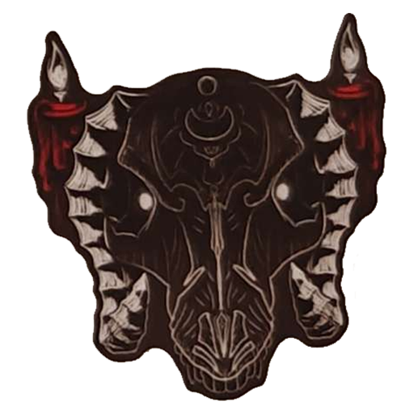
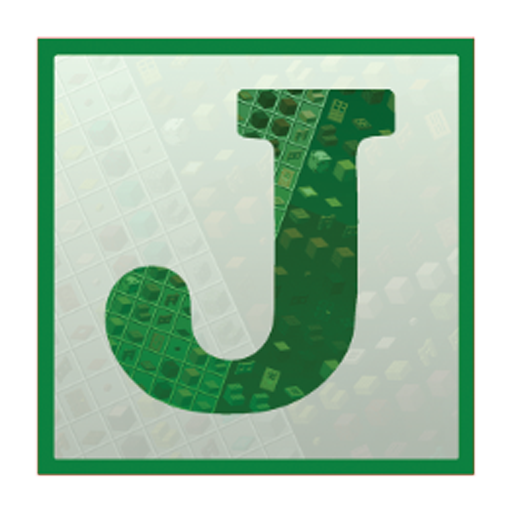
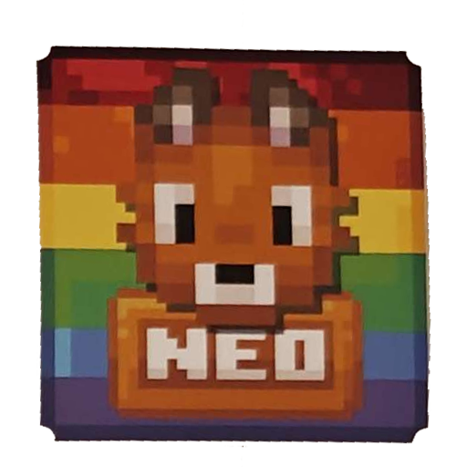

As part of an effort to reduce delays, costs, and waste, we have been heavily investing in our own in-house sticker 
production! This means we can now design, print, and cut high-quality stickers ourselves without relying on third party
suppliers. By handling production directly, we gain the following benefits!

- **Faster turnaround times** - No more waiting on proofs, international shipping, or business day restrictions.
- **Lower Costs** - We save costs on 3rd party markups, international shipping, and import fees!
- **Less Waste** - We only produce the quantity we need, reducing excess and leftover stock.
- **Flexibility** - Greater control over the process lets us experiment with sizes, finishes, and materials.

## Costs
It will cost $15 for each matte sticker design that is 3x3 inches (7.6cm) or smaller. We are also asking each sponsor
for $10 USD to help cover the costs of shipping sticker packs to participants. Please send payments using PayPal.

The following table is a rough break down for costs based on one sticker.

| Line Item     | Notes             | Cost (USD) |
|---------------|-------------------|------------|
| Logo Sticker  | 5cm x 5cm - matte | $15        |
| Shipping Flat |                   | $10        |
| Total         |                   | $25        |

The following table is a rough break down for costs based on three stickers.

| Line Item     | Notes             | Cost (USD) |
|---------------|-------------------|------------|
| Logo Sticker  | 5cm x 5cm - matte | $15        |
| Tool Sticker  | 7cm x 7cm - matte | $15        |
| Mob Sticker   | 3cm x 7cm - matte | $15        |
| Shipping Flat |                   | $10        |
| Total         |                   | $55        |

## Artwork Setup

### Provide Your Artwork
Please provide us with a PNG or PSD of your sticker artwork that is set up for 300dpi. The most common sticker size for 
Modtoberfest is 2x2 inches, which would be a 600x600 pixel file. The stickers will be cut along the edges of your 
artwork so it is very important to ensure your artwork is continuous and does not have any gaps or holes. To ensure your
sticker is cut cleanly, it is also important to add an outer border to the artwork, or account for an internal offset.
If you are not comfortable doing this yourself, or need some help please reach out on 
[Discord](https://discord.modtoberfest.com) and we will set you up quickly!

### Resident Artist
If you have an idea for a sticker but don't have art or an artist, our resident artist may be available! She specializes
in a fun and expressive chibi style that works very well with stickers! For $20 USD she will create a print-ready design
that we can print in-house. You will also receive the image file(s) and full commercial rights to use the design as you
see fit outside of the event! If you're interested, please reach out and let us know! You can see some of her past work
below!

:::tip[Please Note]{icon="heart"}
$20 is her discounted commission rate for sponsors of Modtoberfest. This price does not include the $15 USD for printing
the sticker or $10 for shipping. Also, while her examples include fan art for popular characters, you must have the
rights to any designs used for Modtoberfest.
:::

## FAQ

### What size are the stickers?
The size of the sticker depends on the artwork you submit, however the sticker can be scaled up to 3x3 inches (7.6cm). 
The most common sticker size for Modtoberfest is 2x2 inches (5cm).

### Are you only offering matte stickers?
We are focusing on matte stickers because they are what we have the most experience creating. In some cases we may be 
able to offer glossy or holographic stickers, however the cost will be slightly higher.

### Can we do custom cut lines?
Yes, if you would like your sticker to have a custom cut line please let us know when we are setting up your art.

### How many stickers will you print?
To reduce waste we will only print enough stickers to cover all participants who have completed the challenge and some
to handle replacements for packages that are lost, damaged, or destroyed.

### Will you show proofs before the sticker is made?
Yes, we will keep you updated throughout the process and ask you to approve cut lines and show you photos of a hard-copy
of your sticker.

### How are the stickers made?
We print stickers on matte vinyl paper using a high-quality printer. They are then precision-cut using a professional 
desktop cutting machine, ensuring clean edges and a consistent shape every time. This process is the same setup used by
established Etsy shops, conventions, and small businesses.

### Have your stickers been tested?
Yes! Our stickers have already been put to the test by several local businesses over the past few months. Our stickers 
have been used on phone cases, deck boxes, and even cars! So far they have held up well through everyday wear and tear.

### Are the stickers waterproof?
Our stickers are water-resistant. They can handle light contact with water, such as splashes of rain, without washing 
off or warping. However, we do not advertise them as fully waterproof as long-term exposure to water or submersion may
affect the durability over time.

### Why are bleed lines important?
Bleed lines are an area of the design that extends beyond the cut lines of the design. The extended area is used to
ensure that there are no unexpected white edges or gaps along the edge of the design. In our internal testing, we have
found that stickers should have at least 0.5mm (6px) of extra space to account for this. If your artwork does not have
bleed lines, an internal offset will be used instead. **This is especially important for pixel art!**

### How accurate are your colors?
Color accuracy can depend on many factors such as lighting, paper, ink, and the monitor you are viewing this page with.
In our experience the colors have decent accuracy but can be over saturated in some situations. The table below compared
a few stickers that were used in previous Modtoberfest events.

|                    In-House                     |                     Raw PNG                      |                Previous Supplier                 |
|:-----------------------------------------------:|:------------------------------------------------:|:------------------------------------------------:|
|  |  |  |
|   |   |   |
|   |   |   |
|   |   |   |