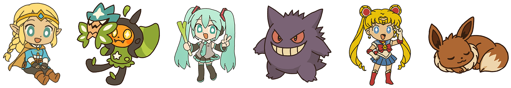
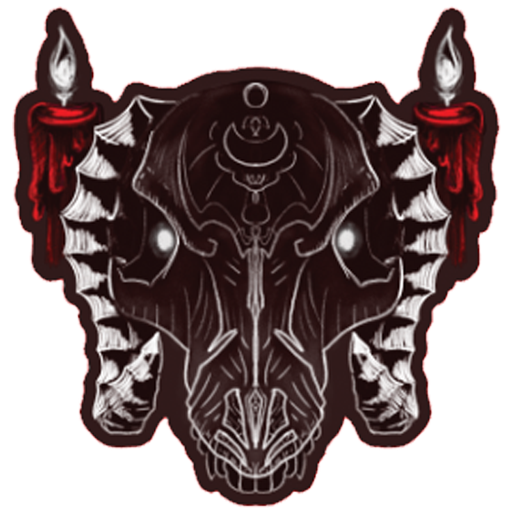
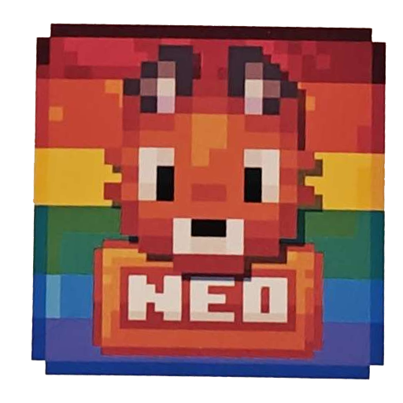

As part of an effort to reduce delays, costs, and waste, we have been heavily investing in our own in-house sticker
production. This means we can design, print, and cut high quality stickers ourselves! You can also join our group order
with [Zap Creatives](https://zapcreatives.com), which we have used reliably for several years now. In both cases, you would send us your
artwork as a PNG or PDF and some money on PayPal to cover the expenses. We are also asking all sponsors for $15 USD to
help cover shipping related expenses. Stickers from Zap are a bit more expensive and have a shorter deadline because
they take longer to receive.

## Resident Artist
If you don't have art or an artist, our resident artist may be available! She specializes in a fun chibi style that
works very well with stickers! For $20 USD she will create a print-ready design that you can use for Modtoberfest. You
will also receive the image file(s) and full commercial rights to use the design. You can see some of her past work
below.

:::tip[Please Note]{icon="heart"}
$20 is her discounted commission rate for sponsors of Modtoberfest. This price is for the commission, and does not
include the printing or shipping costs. Also, while the examples include fan art of popular characters, you must have
the rights to any design used for Modtoberfest.
:::

## In-House Stickers
Our in-house stickers cost $20 USD per design. Your sticker can be up to 3x3 inches (7.6cm) in size and will be die-cut
to the perfect shape. Your sticker will be printed on vinyl and have a matte finish. **Your design must be submitted and
finalized by October 10th!**

| Line Item     | Notes                            | Cost (USD) |
|---------------|----------------------------------|------------|
| Sticker 1     | 3x3 inches (7.6cm) - matte vinyl | $20        |
| Sticker 2     | 2x2 inches (5cm) - matte vinyl   | $20        |
| Shipping Flat |                                  | $15        |
| **Total**     |                                  | **$55**    |

## Group Order - Zap Creative
Stickers from Zap will cost $30 USD per design. Your sticker can be up to 2x2 inches (5cm) in size and will be die-cut
to the perfect shape. Your sticker will be printed on vinyl and have a matte finish. **Your design must be submitted and
finalized by September 17th!**

| Line Item     | Notes                          | Cost (USD) |
|---------------|--------------------------------|------------|
| Sticker 1     | 2x2 inches (5cm) - matte vinyl | $30        |
| Sticker 2     | 2x2 inches (5cm) - matte vinyl | $30        |
| Shipping Flat |                                | $15        |
| **Total**     |                                | **$75**    |

:::caution
Zap Creatives offers many kinds of awesome products. While the focus of our group order is 2x2 inches (5cm) matte vinyl
stickers, you **can** request different finishes or sizes. Please keep in mind that this may increase the price. Other
finishes include glossy, holographic, and iridescent.
:::

## Sticker Color Comparison
Color accuracy can depend on many factors such as lighting, paper, and ink. The monitor you are viewing this page with
can also affect your perception of color accuracy. We have taken photos of several stickers in the same lighting for
comparison. In our experience, both have decent color accuracy, however our in-house stickers can be over-saturated on
some colors,

|                   In-House                   |                    Raw PNG                    |                 Zap Creatives                 |
|:--------------------------------------------:|:---------------------------------------------:|:---------------------------------------------:|
|  |  |  |
|   |   |   |
|   |   |   |
|   |   |   |

## Bleed Lines
When making stickers it is very important to add bleed lines. Bleed lines are an area of the design that extend beyond
the cut lines of the design. The extended area ensures that there are no unexpected white edges or gaps along the edge
of the design. This is why most stickers have a thick white border surrounding them. Bleed lines are especially
important for pixel art signs. Our in-house stickers require at least **0.5mm (6px)** of space, while Zap suggests
**1mm (12px)** for their stickers. In both cases, we recommend making a thick border that will be cut down.

## Artwork Setup
:::tip[Please Note]{icon="heart"}
If you need help with the setup process we can help, just reach out on Discord!
:::

1) The stickers will be printed at 300 DPI. Please use 600x600px for 2x2 Inch (5cm) stickers or 900x900px for 3x3 Inch (7.6cm) stickers.
2) Make sure you have a bleed line, or account for an internal offset on the design.
3) Make sure the art is continuous, with no internal gaps or holes.
4) Send us all of the artwork as PNG or PSD files in a ZIP folder.

Once we have your artwork we will help you make any necessary changes and show you a preview of the cut-lines. If you
chose in-house stickers we will also show you a picture of a hard-proof copy of your sticker.

## FaQ

### What size will the stickers be?
The final size of the sticker ultimately depends on your designs and the cut lines you approve. If you want something 
different please let us know when we prepare your stickers.

### Are you only allowing matte vinyl stickers?
For our in-house stickers we are focusing on matte vinyl stickers. That's what we have the most experience with making
right now. If you would like something different, please consider Zap Creative. Their glossy, holo, and iridescent 
stickers are great.

### How many stickers are being made?
If your sticker is being made in-house we will print as many as needed to send one to all eligible participants. If you
are using Zap Creatives we will be ordering 100 of each sticker. If there are any left over, they will be used to cover
replacements or given out in future events.

### Are the in-house stickers reliable?
Yes, our stickers have been put to the test by several local businesses this year! Our stickers have been used on
phones, water bottles, TCG deck boxes, and even a car! So far they have held up well through everyday wear and tear. 
They can handle light contact with water such as splashes or rain without washing off or warping. We do not advertise 
them as being waterproof as long-term exposure to water or submersion may affect the durability over time.

### How are the in-house stickers made?
We print stickers on matte vinyl paper using a high quality printer. We then let the stickers cure for at least one day,
ensuring the ink is bonded. They are then precision-cut using a computer driven cutting machine, ensuring clean edges
and a consistent shape every time. This process is the same setup used by established Etsy shops, conventions, and small
businesses.

### How many designs can I do?
There is no hard limit on the number of designs you can submit, however we ask that you only submit multiple designs if 
they each bring something unique. For example, submitting five stickers that are nearly identical but have a different
background is discouraged, but submitting completely different designs, or having a normal and spooky version of the
same design is fine.

### Can I do a split run?
In this context a split run is when you have slight variants of a design as part of a single sticker run. For example 
you may want half your stickers to have a red border and the other half to be green, or maybe you want only 5% of your 
stickers to be a rare holographic version. This can **not** be done with our Zap Creatives group order, however we do 
have a limited capacity to do this with our in-house stickers. 